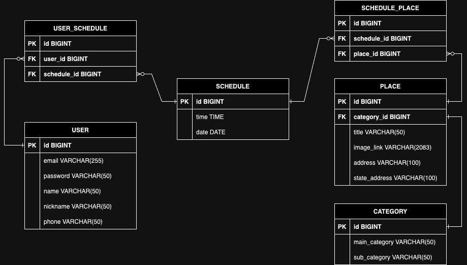

# HAP

# 프로젝트 요약

장소 추천 및 일정 저장 어플리케이션

---

# 목차

1. 기능 요구 사항
2. DB 설계
3. RESTful API 명세서
4. 서버 구조 설계
...

---

# 기능 요구 사항

1. 장소 추천 (놀거리, 먹거리)
2. 일정 및 동선 저장
3. 일정 정보 공유

---

# DB 설계

## 테이블 리스트

### 유저 테이블

1. 유저 id 식별자 PK
2. 이메일 (아이디) 대체키
3. 비밀번호 
4. 이름
5. 닉네임     
6. 전화번호  

### 일정 테이블

1. 일정 id 식별자 PK
2. 장소 id 식별자 FK
3. 시간
4. 날짜

### 장소 테이블

1. 장소 id 식별자 PK
2. 카테고리 id 식별자 FK
3. 제목 (타이틀)
4. 이미지 링크
5. 주소
6. 도로명 주소

### 카테고리 테이블

1. 카테고리 id 식별자 PK
2. 대분류: 먹거리, 놀거리
3. 소분류: 중식, 일식 등등, 이색체험, 보드게임 카페 등…

### 회원 - 일정 연결 테이블

1. 회원 - 일정 id 식별자 PK
2. 회원 id 식별자 FK
3. 일정 id 식별자 FK

### 일정 - 장소 연결 테이블

1. 일정 - 장소 id 식별자 PK
2. 일정 id 식별자 FK
3. 장소 id 식별자 FK

---

## ERD



---

# RESTful API 설계

## API 참고사항

POST 방식의 API 호출의 응답은 다음과 같다.

헤더: 상태코드를 포함한다.

바디: 메세지를 JSON 형식으로 응답한다.

GET 방식의 API 호출의 응답은 다음과 같다.

헤더: 상태코드를 포함한다.

바디: API 에 알맞는 데이터를 JSON 형식으로 응답한다.

회원 API, 인증 API 를 제외한 일정 API, 검색 API 는 토큰을 꼭 기입해야한다.

단, 회원 API 로그아웃의 경우 토큰을 헤더에 기입해야한다.

인증 API의 식별자는, 회원 가입 / 비밀 번호 변경(찾기)을 구분하기 위한 식별자를 말한다.

식별자는 각각 {singup} / {changePassword} 로 구분된다.

---

## 회원 API

### POST /api/v1/user

- 회원 가입을 진행한다.
- Body에 아이디, 비밀번호, 이름, 닉네임, 전화번호를 JSON 형식으로 기입해야 한다.
    ```json
    {
      "email": "{이메일}",
      "password": "{패스워드}",
      "name": "{이름}",
      "nickname": "{닉네임}",
      "phone": "{전화번호}"
    } 
    ```
- 이메일(아이디) 인증 절차와 전화번호, 닉네임은 중복 확인 절차를 거친 후 호출 해야한다.
- 호출 성공 시: 성공 메세지를 JSON 형식으로 응답한다.
    ```json
    {
      "status": "OK",
      "message": "SUCCESS"
    }
    ```
- 호출 실패 시: 에러 메세지를 JSON 형식으로 응답한다.
    ```json
    {
      "status": "{ErrorCode}",
      "message": "{ErrorMessage}"
    }
    ```
  (아이디, 전화번호, 닉네임 중 하나 이상 중복되는 경우)

### GET /api/v1/duplicate/email?email={email}

- 이메일의 중복을 확인한다.
- 호출 성공 시: 성공 메세지를 JSON 형식으로 응답한다.
    ```json
    {
      "status": "OK",
      "message": "사용가능한 이메일입니다."
    }
    ```
- 호출 실패 시: 에러 메세지를 JSON 형식으로 응답한다.
    ```json
    {
      "status": "409",
      "message": "해당 이메일은 이미 사용중입니다."
    }
    ```

### GET /api/v1/duplicate/nickname?nickname={nickname}

- 닉네임의 중복을 확인한다.
- 호출 성공 시: 성공 메세지를 JSON 형식으로 응답한다.
    ```json
    {
      "status": "OK",
      "message": "사용가능한 닉네임입니다."
    }
    ```
- 호출 실패 시: 에러 메세지를 JSON 형식으로 응답한다.
    ```json
    {
      "status": "409",
      "message": "해당 닉네임은 이미 사용중입니다."
    }
    ```

### GET /api/v1/duplicate/phone?phone={phone}

- 전화번호의 중복을 확인한다.
- 호출 성공 시: 성공 메세지를 JSON 형식으로 응답한다.
    ```json
    {
      "status": "OK",
      "message": "사용가능한 전화번호입니다."
    }
    ```
- 호출 실패 시: 에러 메세지를 JSON 형식으로 응답한다.
    ```json
    {
      "status": "409",
      "message": "해당 전화번호는 이미 사용중입니다."
    }
    ```


### GET /api/v1/user/{회원 아이디}

- 아이디, 이름, 전화번호, 닉네임을 출력한다.
- 호출 성공 시: 아이디, 이름, 전화번호, 닉네임을 JSON 형식으로 응답한다.
- 호출 실패 시: 에러 메세지를 JSON 형식으로 응답한다.
(회원 아이디가 조회되지 않는 경우)

### PATCH /api/v1/user/{회원 아이디}

- /api/v1/user/password/{회원 아이디} 비밀번호 변경
해당 API는 본인 인증 절차를 거친 후에 호출해야 한다.

- /api/v1/user/user_phone/{회원 아이디} 전화번호 변경
해당 API는 닉네임 중복 확인 절차를 걸친 후 호출해야 한다.

- /api/v1/user/user_nickname/{회원 아이디} 닉네임 변경
해당 API는 닉네임 중복 확인 절차를 걸친 후 호출해야 한다.

- 호출 성공 시: 성공 메세지를 JSON 형식으로 응답한다.
- 호출 실패 시: 에러 메세지를 JSON 형식으로 응답한다.
(전화번호, 닉네임 중 하나 이상 중복되는 경우)

DELET /api/v1/user/{회원 아이디}

- 회원 정보를 삭제한다.
- 호출 성공 시: 성공 메세지를 JSON 형식으로 응답한다.
- 호출 실패 시: 에러 메세지를 JSON 형식으로 응답한다.
(회원 아이디가 조회되지 않는 경우)

POST /api/v1/user/login

- 로그인을 진행한다.
- Body에 아이디, 비밀번호를 JSON 형식으로 기입해야 한다.
- 호출 성공 시: 토큰을 JSON 형식으로 응답한다.
- 호출 실패 시: 에러 메세지를 JSON 형식으로 응답한다.
(아이디 또는 비밀번호가 올바르지 않은 경우)

POST /api/v1/user/logout

- 로그아웃을 진행한다.
- 헤더 토큰 값으로 사용자를 유추한다. 즉, 헤더에 토큰을 올바른 형식으로 기입해야 한다.
- 호출 성공 시: 성공 메세지를 JSON 형식으로 응답한다.
- 호출 실패 시: 에러 메세지를 JSON 형식으로 응답한다.
(헤더 토큰 정보가 올바르지 않거나 누락된 경우)

---

### 인증 API

GET /api/v1/emailVerifications/{회원 아이디}&{식별자}

- 해당 이메일로 인증 코드 발송한다.
- 회원가입 / 비밀번호 변경 식별자를 올바르게 기입해야 한다.
- 호출 성공 시: 성공 메세지를 JSON 형식으로 응답한다. 그리고 해당 메일로 인증 번호가 전송된다.
- 호출 실패 시: 에러 메세지를 JSON 형식으로 응답한다.
(아이디가 올바르지 않은 경우, 식별자를 잘못 기입한 경우)

POST /api/v1/emailVerifications/

- 인증 번호를 인증한다.
- Body에 아이디, 식별자, 인증 번호를 JSON 형식으로 기입해야 한다.
- 호출 성공 시: 성공 메세지를 JSON 형식으로 응답한다.
- 호출 실패 시: 에러 메세지를 JSON 형식으로 응답한다.
(인증 코드를 잘못 기입한 경우, 인증 번호 기한이 지난 경우)

---

### 검색 API

GET /api/v1/search/{지역}&{카테고리} 

- 네이버 API를 통해 해당 {지역}의 {카테고리}를 검색한다.
- 호출 성공 시: 타이틀(가게 이름), 이미지 링크, 주소, 도로명 주소, 카테고리를 JSON 형식으로 응답한다.
- 호출 실패 시: 에러 메세지를 JSON 형식으로 응답한다.
(해당 키워드의 검색 결과가 없는 경우, 해당 부분은 테스트를 진행해봐야 할 것 같음)

---

### 일정 API

POST /api/v1/schedule 일정 등록

- 

GET /api/v1/schedule/{회원아이디}&{날짜} 회원의 일정 조회

- 

PUT /api/v1/schedule/{회원아이디} 회원의 일정 전체 수정

- 

DELET /api/v1/schedule/{회원아이디} 회원의 일정 정보 삭제

- 

---

# 서버 구조 설계

...